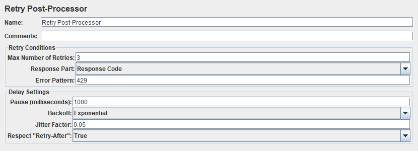

# jmeter-retrier [![travis][travis-image]][travis-url]

[travis-image]: https://travis-ci.com/tilln/jmeter-retrier.svg?branch=master
[travis-url]: https://travis-ci.com/tilln/jmeter-retrier

Overview
--------

This Apache JMeter plugin provides a Post-Processor that retries failed samples.

### Motivation

JMeter provides no mechanism to retry failed samplers.
Sample errors can be ignored (and the thread continues or starts the next loop)
or the thread can be stopped.

Scripts that contain a sequence of user interactions have no easy way to recover from sampler errors,
but loops and conditions have to be explicitly built into the scripts.

For example, stress tests may get throttled
(e.g. [HTTP 429](https://developer.mozilla.org/en-US/docs/Web/HTTP/Status/429))
but the script should continue its flow, however, the throttled request would need to be retried.

### Results Representation 

Retries are added as sub-results,
with the initial, failed attempt as the first sub-result with the original label,
and all retries thereafter.
All retries are labelled with a suffix ("-retry*N*" with _N_ enumerating the attempts).

The main result contains:
- Request and response data of the final attempt, so that assertions can be applied,
- Total byte count of all attempts, 
- Total response time of all attempts (without pauses),
- Label suffix "-retry" (without number).

Usage
-----

### Retry Post-Processor

Simply add a *Retry Post-Processor* to the [Scope](https://jmeter.apache.org/usermanual/test_plan.html#scoping_rules)
of samplers that should be retried.

Parameters:

- *Max Number of Retries*: Positive number limits the number of retries, negative retries infinitely, zero means no retries (default: 0).
- *Pause (milliseconds)*: How long to pause before retrying the sampler or zero for no pause (default: 0).
- *Response Codes*: Regex of response codes for which to retry, or empty to retry any unsuccessful sample result (default: empty).
- *Respect "Retry-After":* Whether to respect an HTTP response header "Retry-After" before retrying (default: False).
If a *Pause* is defined as well, the greater of the two values will be used.  

Note that this plugin will not [execute](https://jmeter.apache.org/usermanual/test_plan.html#executionorder)
other JMeter elements, i.e. Pre-Processors, Timers, Post-Processors and Assertions as part of a retry.

Pre-Processors and Timers will only be executed **once**, before the initial attempt.
Likewise, Post-Processors and Assertions will only be executed **once**, after the final attempt
(or before in case of Post-Processors that appear before the *Retry Post-Processor*).

### JMeter Properties
The following properties control the plugin behaviour:

- `jmeter.retrier.sampleLabelSuffix`:
  Suffix to append to the retried sample's label.
  (default: "-retry").

Installation
------------
<!--
### Via [PluginsManager](https://jmeter-plugins.org/wiki/PluginsManager/)

Under tab "Available Plugins", select "Sample Retrier", then click "Apply Changes and Restart JMeter".

### Via Package from [JMeter-Plugins.org](https://jmeter-plugins.org/)

Extract the [zip package](https://jmeter-plugins.org/files/packages/tilln-retrier-1.0.zip) into JMeter's lib directory, then restart JMeter.
-->
### Via Manual Download

1. Copy the [jmeter-retrier jar file](https://github.com/tilln/jmeter-retrier/releases/download/1.0-SNAPSHOT/jmeter-retrier-1.0-SNAPSHOT.jar) into JMeter's lib/ext directory.
2. Restart JMeter.

Limitations
-----------

- Minimum JMeter version 5.0
- Pre-Processors, Timers, other Post-Processors, and Assertions are **not** executed when retrying, but only once (before the first attempt or after the last)
- Connect Time, Latency and Idle Time are not accumulated
